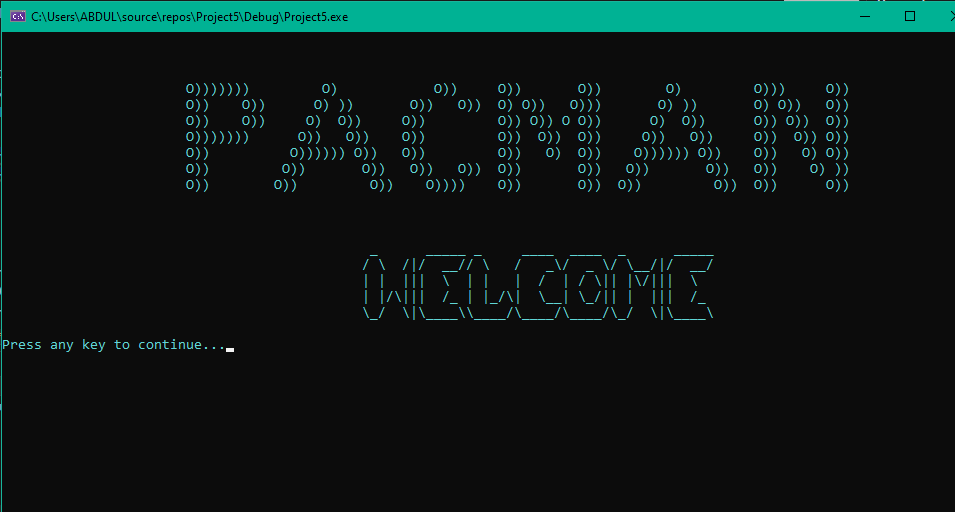
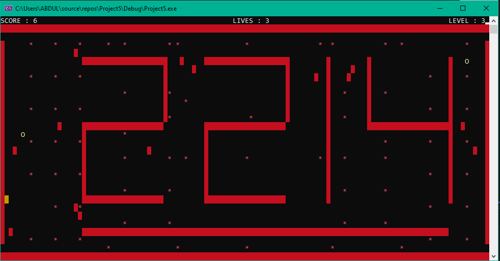
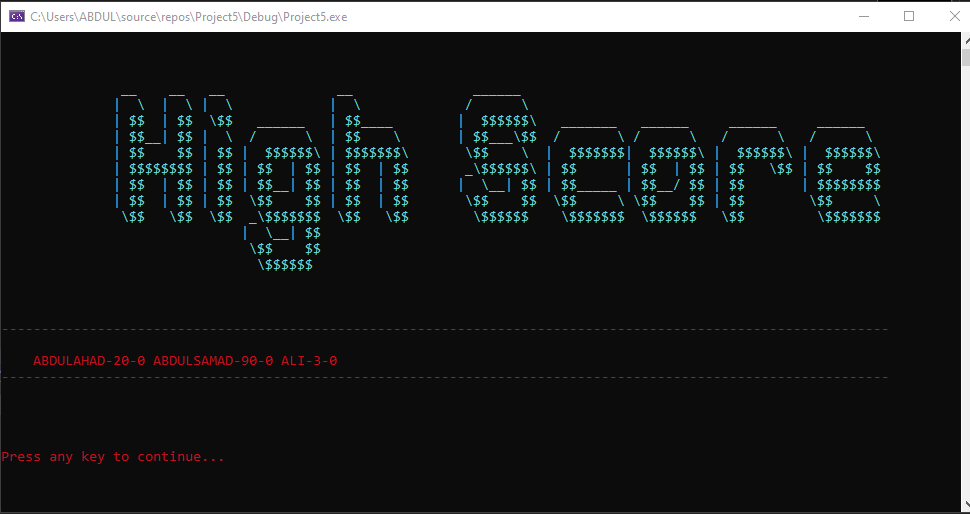

# Pac-Man Game in Assembly (8086) 🎮

---

## Overview
This project implements a classic **Pac-Man** game using Assembly language (8086) in **Visual Studio**. The game features three progressively challenging levels, complete with unique maze layouts, ghost behaviors, and objectives. The project demonstrates expertise in Assembly programming, game logic, and graphics manipulation.

---

## Features
- **Three Levels**:
  - **Level 1**: Introductory maze layout with basic ghost behavior. 🟢
  - **Level 2**: More complex maze, diverse ghost behaviors, and power pellets. 🟠
  - **Level 3**: Advanced maze with teleportation paths, boss ghost, and hidden shortcuts. 🔴
- **Player Lives**:
  - Players start with three lives. ❤️❤️❤️
  - Extra life available in Level 3 by collecting cherries. 🍒
- **Ghost AI**:
  - Predictable behavior in Level 1. 👻
  - Strategic movement in Level 2. 🎯
  - Advanced, coordinated AI with boss ghost in Level 3. 🧠
- **File Handling**:
  - Stores players' names and high scores in a file, sorted by score. 📁
- **Sound Effects**:
  - Integrated sound features to enhance gameplay. 🔊
- **Screen Size**:
  - The game runs in a 640x480 resolution. 🖥️
- **User Interface Screens**:
  - Welcome Screen (takes player name input). 🎉
  - Game Menu. 📜
  - Gameplay Screen. 🎮
  - Pause Functionality. ⏸️
  - Instructions Screen. 📖
  - High Score Display. 🏆

---

## Installation and Usage
1. **Requirements**:
   - Visual Studio with support for Assembly language. 🛠️
   - Emulator or environment capable of running 8086 Assembly code. 🖥️
2. **Clone the Repository**:
   ```bash
   git clone https://github.com/AbdulAHAD968/pacman-8086.git
   cd pacman-8086
   ```
3. **Build and Run**:
   - Open the project in Visual Studio. ✨
   - Compile and run the game. ▶️

---

## Gameplay Instructions
1. Use the arrow keys to move Pac-Man through the maze. ⬆️⬇️⬅️➡️
2. Collect all the dots to complete the level. ⚪
3. Avoid ghosts, or use power pellets to temporarily eat ghosts. 👻➡️😋
4. Bonus points are awarded for eating fruit. 🍎
5. Extra life can be earned in Level 3. 🍒

---

## Technical Details
- **Language**: Assembly (8086) 🖥️
- **Procedures**:
  - Parameters are passed using the stack (via `PUSH` and `POP`). 🧵
- **Error Handling**:
  - Handles invalid inputs gracefully. 🚫✅
- **Wall Placement Rule**:
  - Walls are placed based on roll number logic (e.g., `2583` → `2553`). 🧱

---

## File Handling
- Scores are stored in a file. 📂
- Player names and highest scores are sorted and saved. 🏅

---

## Screenshots
### Welcome Screen

### Gameplay Screen

### High Score Screen


---

## Project Structure
```
Pacman-8086/
├── src/                # Source code files
├── assets/             # Sound and graphics files
├── docs/               # Documentation and screenshots
├── high_scores.txt     # File storing player scores
├── README.md           # Project documentation
└── LICENSE             # License information
```

---

## Future Improvements
- Add additional levels with increasing complexity. 🆙
- Enhance ghost AI with more dynamic behaviors. 🤖
- Integrate smoother animations and effects. 🌟

---

## Acknowledgments
Special thanks to instructors and peers specially **Iqrash Qureshi** who provided guidance and resources. 🙌

---

## License
This project is licensed under the MIT License. See `LICENSE` for details. 📜

---

## ⚠️ Errors and Omissions

If you encounter any errors, bugs, or have suggestions for improvements, feel free to reach out to me.

You can contact me via email at: [ahad06074@gmail.com](mailto:ahad06074@gmail.com)

Errors and omissions are accepted!

---

## 🤖 Credits

Built with ❤️ by a passionate team of developers. 
The one and only **Abdul Ahad (Null and Void)** and Respected **Iqrash Qureshi**
Graphics powered by **IRVINE32.INC**.

Feel free to **fork**, **contribute**, or **share your thoughts**! 🌟
And if you are going to clone the repositery without credits, **v will see u in hell(corporate).**
